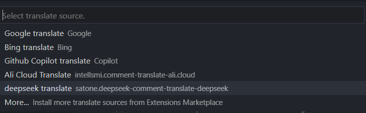

# OpenRouter 智能注释翻译插件

本插件为「Comment Translate」提供OpenRouter的翻译源支持，需配合主插件使用。

## 功能特点

1. 提供智能的代码注释翻译能力
2. 修改配置后自动检测API连接状态
3. 允许自定义系统提示词和翻译提示词

## 使用要求

需先安装 [Comment Translate 插件](https://marketplace.visualstudio.com/items?itemName=intellsmi.comment-translate)

## 使用指南

1. 安装后通过命令面板调用「切换翻译源」功能
    
2. 选择「DeepSeek Translate」并配置API参数
    
3. 在代码编辑器中直接使用翻译功能（快捷键：`Ctrl+Shift+T`）

## 配置说明

本插件提供以下配置项：

| 配置项 | 默认值 | 说明 |
| --- | --- | --- |
| `openrouterTranslate.apiKey` | 必填 | OpenRouter API认证密钥, [获取API密钥](https://openrouter.ai/settings/keys) |
| `openrouterTranslate.model` | `google/gemini-2.0-flash-lite-001` | 模型名称, [查看模型列表](https://openrouter.ai/models?fmt=table) |
| `openrouterTranslate.api` | `https://openrouter.ai/api/v1/chat/completions` | API地址 |
| `openrouterTranslate.prompts.system` |  | 系统提示词, 变量: `{{to}}` (目标语言), `{{content}}` (文本内容) |
| `openrouterTranslate.prompts.translate` |  | 翻译提示词, 变量: `{{to}}` (目标语言), `{{content}}` (文本内容) |
| `openrouterTranslate.timeout` | 600000 | 超时时间, 单位: 毫秒 |

## 配置示例

### 使用官方API（默认配置）
```json
{
  "openrouterTranslate.apiKey": "您的API密钥"
}
```

> 请到 [OpenRouter](https://openrouter.ai/settings/keys) 中获取 API 密钥。

## 翻译模型推荐

1. gemini
2. deepseek
3. claude

> 仅为模型名称，请不要填入 `openrouterTranslate.model` 中。model 字段值请到 [OpenRouter models](https://openrouter.ai/models?fmt=table) 中查找。
